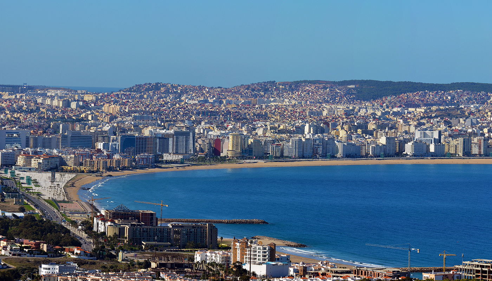

# Introduction
{:width="500px" }

Tanger est située dans la baie du même nom, ouverte sur l'extrémité occidentale du détroit de Gibraltar, à environ 15 km des côtes espagnoles ; et à la périphérie du massif montagneux du Rif. Le port de la ville est la principale destination des bateaux de voyageurs en provenance de L'Europe. Tanger est, par conséquent, l'un des lieux de passage des voyageurs circulant entre le continent européen et africain.

*Tanger*
<!-- new slide -->